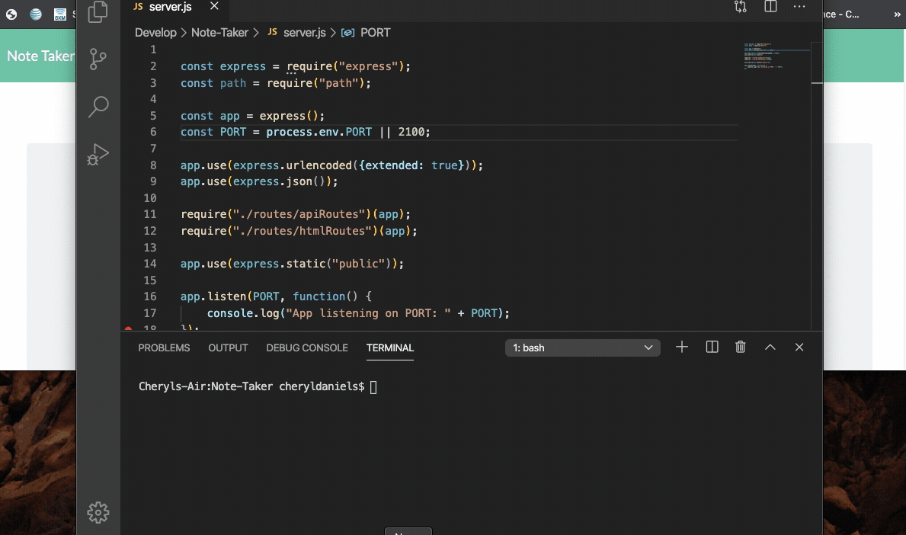

# NOTE-TAKER

## Description: 
This aplication  is a server side application  using Express.js. With this application  the client can write, save, and delete notes. the information is saved and retrieved from a JSON file.

## Table of Content:
  * [Installation](#installation)

  * [Usage](#usage)

  * [License](#license)

## Installation:
npm install

## Usage:
Live Demo: https://dry-retreat-14482.herokuapp.com/

